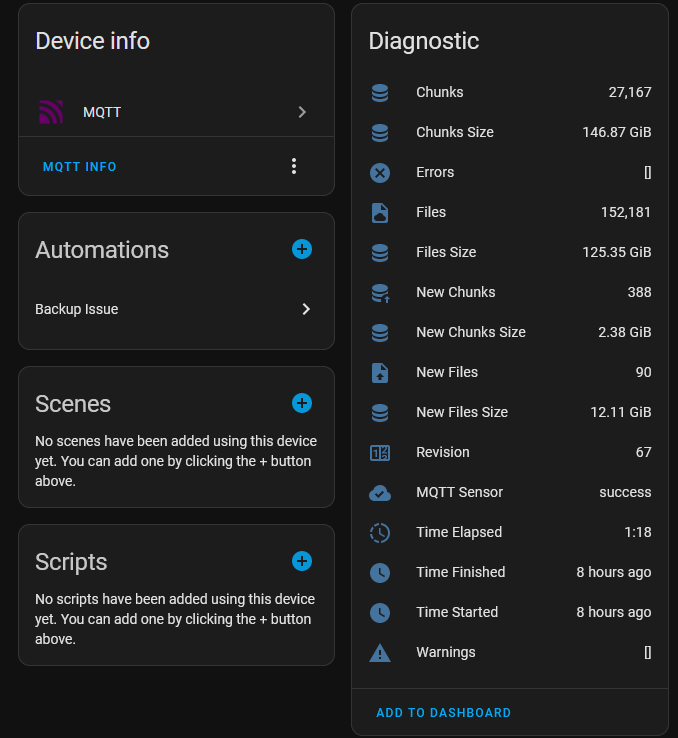
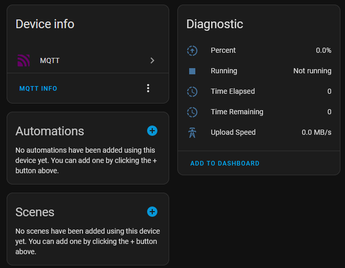
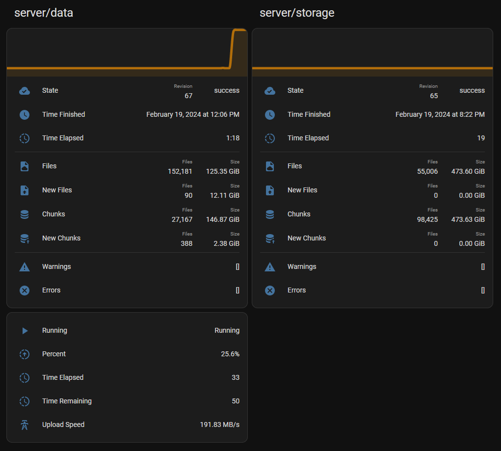

# ha-duplicacy

## Description

This is a project for parsing duplicacy backup logs for the purpose of publishing the stats over MQTT.

This tool provides a commandline script that's intended to be used from either a terminal or as a scheduled task. It will stop any specified containers, call duplicacy backup, and publish the progress and completion stats to MQTT over two topics `duplicacy/<computer_name>/<backup_name>` and `duplicacy/<computer_name>/<backup_name>/progress`. It will also publish home assistant autodiscovery topics to create two devices for each backup; a device for completion state and a device for in-progress backup state.

 

The script will also make use of a lockfile in the backup folder to prevent multiple instances of the script running on the same backup at the same time, but will not prevent multiple different backups from running at once. This is useful in case a backup runs over the next scheduled backup time.

All output will be logged to the log directory as a dated file. The logs do not clean up after themselves currently.

## Setup

There is currently no installer or package, so the repo will have to be cloned to use it. A python environment is necessary. It was developed and tested using Python 3.9 so it may not be compatible with other versions, though likely 3.6 and above should be fine. Install the dependencies using `pip install -r requirements.txt`. From there either call the `duplicacy_runner.py` file directly or create a symlink in a bin directory on your path. 

It's recommended to create a configuration file to contain global settings instead of specifying them as commandline arguments, such as the MQTT connection information. By default it looks for it at `~/.config/duplicacy_runner/config.json`. Fields must match the commandline arguments, with dashes `'-'` replaced by underscore `'_'`. All commandline arguments, save `--backup-dir`, `--configfile`, and `--dry-run` can be specified here. Example:
```JSON
{
    "mqtt_hostname": "127.0.0.1",
    "mqtt_username": "mqttuser",
    "mqtt_password": "hunter2",
    "log_dir": "/path/to/logfolder"
}
```

## Usage

Minimum argument when calling `duplicacy_runner.py` is `--backup-dir`, although `--mqtt-hostname` must be set somewhere as well.

`--backup-dir` is where the duplicacy repository is set up, where you would normally call `duplicacy backup` from  
`--backup-name` is the name used when publishing stats for the backup. If not provided it will be pulled from the duplicacy preferences file  
`--log-dir` is where logfiles will be created in the format `<backup_name>_backup_YYYY-MM-DD-HH-MM.log`  
`--containers` is a list of containers that will be stopped before backup and restarted before execution is complete. Specified as follows, `--containers container1 container2`  
`--discovery-root` is the root MQTT path Home Assistant uses for MQTT discovery. Default value matches the Home Assistant default of `homeassistant`  
`--mqtt-hostname`, `--mqtt-port`, `--mqtt-username`, `--mqtt-password` are the connection details for your MQTT broker  
`--configfile` is the location of your optional configfile. Defaults to `~/.config/duplicacy_runner/config.json`  
`--dry-run` will run the backup in dry-run mode, and will skip starting/stopping any docker containers. All other functionality, such as MQTT publishing, will run as normal  

Additional arguments for `duplicacy backup` can be specified following a `--` delimiter. E.g., `duplicacy_runner -d /some/path -- -vss`. In that case, `-vss` will be appended to the arguments sent to the `duplicacy backup` command.

## Adding to Home Assistant

If MQTT autodiscovery is setup in Home Assistant then the devices should populate themselves automatically. An example card has been included, as well as an example automation for notifying on issues. The automation assumes a manually created helper template binary_sensor entity that turns on when the last completed backup finish timestamp is older than a specified time period. Example template `{{ now() - states('sensor.duplicacy_server_data_time_finished') | as_datetime | as_local > timedelta(days=2) }}`


